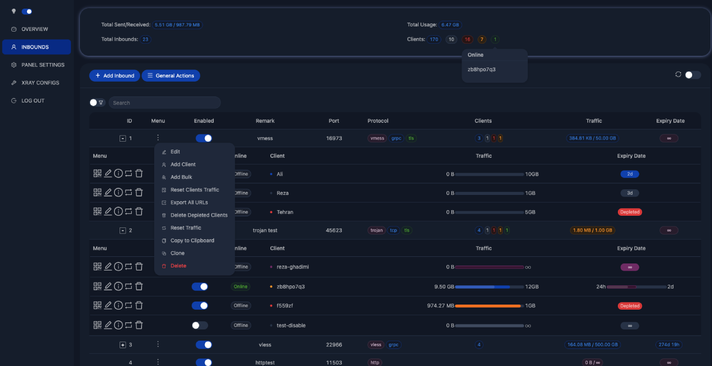

## **请注意：该项目是 alireza0/x-ui 1.10.2 的备份修复，不会更新维护，请不要向该项目提交 Issue 或 Pull Request**

---

# X-UI
**An Advanced Web Panel • Built on Xray Core**

[](https://www.gnu.org/licenses/gpl-3.0.en.html)

> **Disclaimer:** This project is only for personal learning and communication, please do not use it for illegal purposes, please do not use it in a production environment


## Install & Upgrade to Latest Version

```sh
bash <(curl -Ls https://raw.githubusercontent.com/ouyangzhaoxing/alireza0-x-ui/master/install.sh)
```

## Install Legacy Version 1.8.12

```sh
bash <(curl -Ls https://raw.githubusercontent.com/ouyangzhaoxing/x-ui-1.8.12/master/install.sh)
```

## Features

- Supports protocols including VLESS, VMess, Trojan, Shadowsocks, Dokodemo-door, SOCKS, HTTP, Wireguard
- Supports XTLS protocols, including Vision and REALITY
- An advanced interface for routing traffic, incorporating PROXY Protocol, Reverse, External, and Transparent Proxy, along with Multi-Domain, SSL Certificate, and Port
- Support auto generate Cloudflare WARP using Wireguard outbound
- An interactive JSON interface for Xray template configuration
- An advanced interface for inbound and outbound configuration
- Clients’ traffic cap and expiration date based on first use
- Displays online clients, traffic statistics, and system status monitoring
- Deep database search
- Displays depleted clients with expired dates or exceeded traffic cap
- Subscription service with (multi)link
- Importing and exporting databases
- One-Click SSL certificate application and automatic renewal
- HTTPS for secure access to the web panel and subscription service (self-provided domain + SSL certificate)
- Dark/Light theme

## Preview



